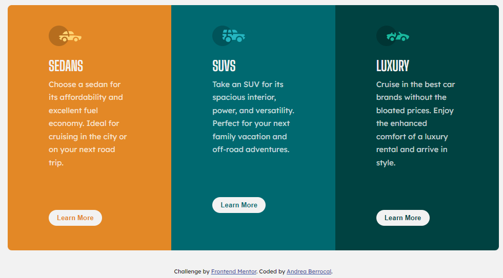
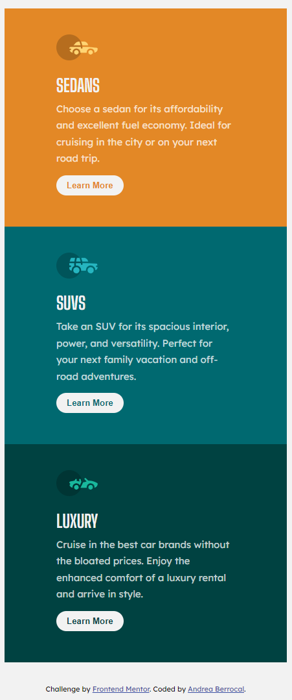

# Frontend Mentor - 3-column preview card component solution

This is a solution to the [3-column preview card component challenge on Frontend Mentor](https://www.frontendmentor.io/challenges/3column-preview-card-component-pH92eAR2-). Frontend Mentor challenges help you improve your coding skills by building realistic projects. 

## Table of contents

- [Overview](#overview)
  - [The challenge](#the-challenge)
  - [Screenshot](#screenshot)
- [My process](#my-process)
  - [Built with](#built-with)
  - [What I learned](#what-i-learned)
  - [Useful resources](#useful-resources)
- [Author](#author)


## Overview

### The challenge

Users should be able to:

- View the optimal layout depending on their device's screen size

### Screenshot




## My process

### Built with

- CSS custom properties
- Flexbox
- CSS Grid

### What I learned

How to use css grid and media queries for responsiveness and how to apply border-radius to only specific corners of an element.

```css
.proud-of-this-css {
  @media(max-width: 1020px){
        .container{
            grid-template-columns: 1fr;
        }
        #car1{
            border-radius: 0;
        }
        #car3{
            border-radius: 0;
        }
        .card-button{
            margin-top: .8rem;
            margin-bottom: .5rem;
        }
    }
}
```

### Useful resources

- [Example resource 1](https://css-tricks.com/snippets/css/complete-guide-grid/)

## Author

- Website - [Add your name here](https://andreacodes-alpha.vercel.app/)
